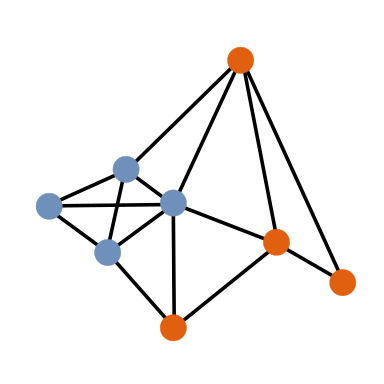

[](https://matlab.mathworks.com/open/fileexchange/v1?id=159001)
[](https://www.mathworks.com/matlabcentral/fileexchange/159001-matlab-igraph)

# matlab-igraph <a href="https://davidrconnell.github.io/matlab-igraph"></a>

A toolbox that brings the power of the [igraph C library](https://igraph.org/) to MATLAB.

See [The documentation](https://davidrconnell.github.io/matlab-igraph)
for a more thorough introduction.

The igraph C library provides efficient graph analysis functions
including graph generation, reading/writing graphs to file, and
community detection.

This toolbox aims to provide a consistent API to perform graph analyses
inside MATLAB while following MATLAB's conventions.

In MATLAB, graphs can be stored as adjacency matrices or using MATLAB's builting graph class.
By using standard matrices, it's easy to produce and process graphs using builtin functions.
Both full and sparse adjacency matrices are supported along with different data types (doubles and logicals).
This allows flexibility and easy integration into preexisting projects.

See the getting started live script in the toolbox for basic usage.

**For File Exchange users** if downloading from the File Exchange or
using MATLAB's Add-ons manager, you may want to run
`igraph.postinstall()` after the installation to remove files that are
not required on your system.

## Citation

If you publish results generated with the help of this package, make
sure to cite igraph:

> Csardi, G., & Nepusz, T. (2006). The igraph software package for
> complex network research. InterJournal, Complex Systems, 1695.

## Installation

See [The installation
guide](https://davidrconnell.github.io/matlab-igraph/docs/installation)
for a more in-depth instructions and error resolution.

### Pre-compiled toolbox (recommended)

You can use MATLAB Add-ons manager. This will track toolbox updates.
It's also possible to download the toolbox directly from the [release page](https://github.com/DavidRConnell/matlab-igraph/releases), however, this will need to be manually updated. If manually downloading the toolbox, double click on the file (ending in `.mltbx`) in MATLAB to install.

### Building the toolbox

In addition to MATLAB this toolbox depends on `cmake`, `bison`, `flex`, and `libxml2`.
On Windows, you will need to install the msys environment and download the dependencies using the provided `pacman` package manager.
To build, start in the root directory of this git repo and run:

```bash
mkdir build
cd build
cmake ..
cmake --build .
```

See `cmake`'s docs for more options, using the `Ninja` generator (depends on the `ninja` build tool) instead of the default `make` is faster.

You can build the package target to get a toolbox with all the files in the correct place:

```bash
cmake --build . --target package
```

Then unzip the package and add the contained toolbox to MATLAB's path.

### Development

Since the toolbox is a mix of MATLAB source files and compiled files that end up in build directory, the easiest approach for development (on Linux and macOS) is to add the source directory to MATLAB's path, build the default target, and link the compiled files to the correct location in the source directory.
From the build directory:

```bash
cd ../toolbox/+igraph/private
ln -s ../../../build/mex/*.mexa64 .
cd ../../../tests/mxIgraph/private
ln -s ../../../build/tests/*.mexa64 .
```

Where `mexa64` is the Linux mex extension.
Now MATLAB will automatically reload compiled files when they are rebuilt.
There will also be a `compile_commands.json` in the build directory that can be linked to the root of the repository.

Unfortunately, this will not work on Windows since the compiled files will not be able to find their dynamic libraries.
Instead, add a '--install-prefix' to the `cmake` config command then running `cmake --install build` will install all files needed to that location.
Add the install path to MATLAB's path.
In this case, the install command will need to be rerun whenever m files are changed.

### Testing

Tests can be run using `ctest` with the `--test-dir` being set to the
build directory. For interactive development, it's faster to run
`buildtool` in a running MATLAB instance since it doesn't require
repeatedly starting MATLAB. To run all tests:

```matlab
buildtool test
```

Test can be replaced with `testMxIgraph` or `testToolbox`.

## See also

- [igraph homepage](https://igraph.org/)
- [igraph R package](https://r.igraph.org)
- [igraph python package](https://python.igraph.org)
- [igraph Mathmatica package](http://szhorvat.net/mathematica/IGraphM)
- [igraph C library](https://igraph.org/c)
